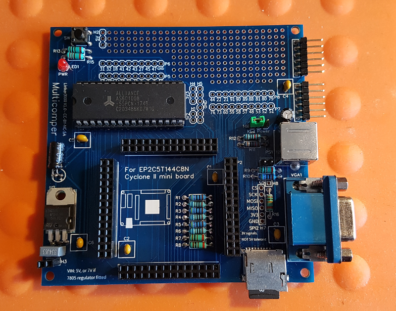
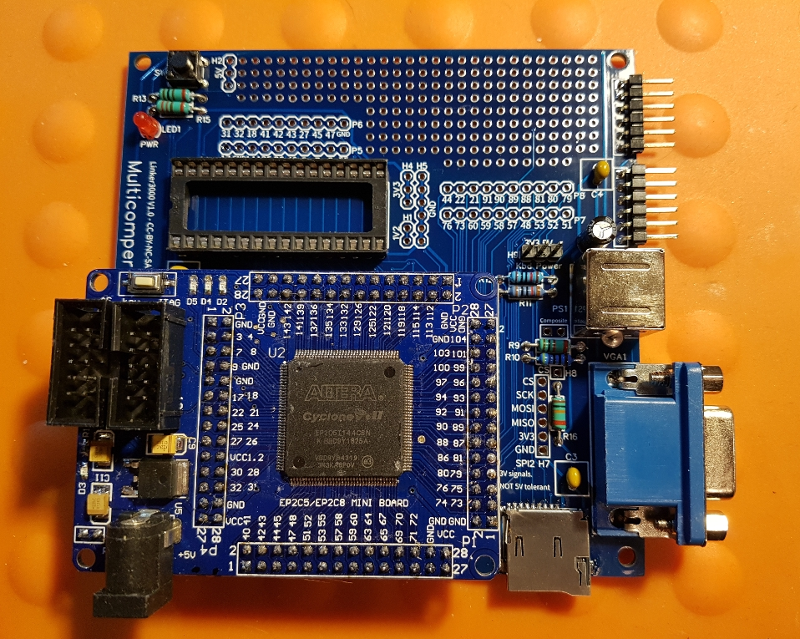
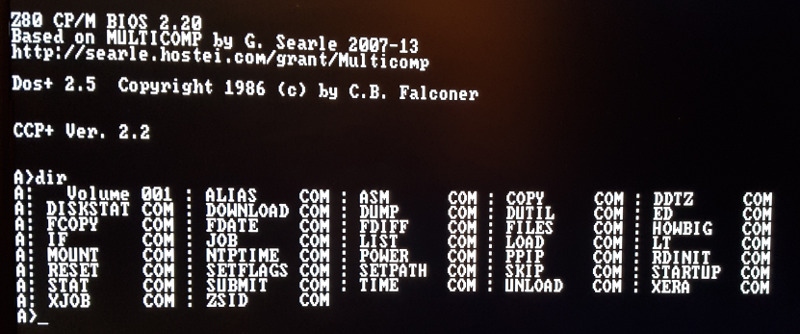

# Multicomper

**This is a hobby project and comes with no official support. The PCB schematic and board design files are offered 'as is' with no claims made about their fitness for any specific purpose.**  

A motherboard for the EP2C5T144C8N Cyclone II dev board and 'Multicomp'-based FPGA computers with Z80, 6502 and 6809 soft cores.

The Multicomper motherboard is a simple platform for creating a UK101 functional or 'Multicomp' computer based on the design work of Grant Searle: 

http://zx80.netai.net/grant/uk101FPGA/index.html

http://zx80.netai.net/grant/Multicomp/index.html

Full schematics and PCB files here: https://easyeda.com/linker3000/multicomp-cyclone-ii

The main additional part needed is a low-cost Cyclone II development board from your favourite auction site or other supplier - search for *EP2C5T144C8N mini board*, but do **read the notes below BEFORE ordering**.

The Multicomper has the following features:

* A prototyping area.
* All spare FPGA pins are broken out to headers do you can use them for your own purposes.
* A ‘key’ (reset) button in parallel with the one on the FPGA board.
* An optional regulated 5V power circuit in case you need it.
* A micro-SD card slot – See notes below.
* Two serial port headers (NB: 3.3V logic like all the I/O).
* VGA and PS/2 keyboard port.
* Composite video header.
* Second SPI port with separate CS header pin (link it to the FPGA pin of your choice).

Notes:

**FPGA development board – IMPORTANT**

You should purchase a version of the board that does NOT have the header pins already fitted because for the Multicomper these need to be soldered to the bottom side of the board as below:

On the dev board, FPGA pins 26 and 81 are directly connected to 1.2V by 0 ohm resistors (which you can remove if you want to use these pins for your own purposes). The default device setup in the Quartus software is to link all unused pins to GND - which means these pins could be shorted to ground and this makes the FPGA and the 1.2V regulator get very hot! Once you have loaded a project for the board, go to Assignments...Device...Device and Pin Options...Unused Pins and set this to "As input tri-stated with weak pull-up".

Also make sure that the internal pullup resistor is enabled on the reset ('key') tact switch pin: In the Quartus software, with a design project open, go to 'Assignments...Pin Planner', right click in any field and select 'Customize Columns'. Add 'Weak Pull-Up Resistor' to the columns to show and click 'OK'. Next make sure that the Weak Pull-Up Resistor is enabled for 'n_reset', which is pin 144.

You will need a programming tool to setup the development board. Many suppliers will also sell you a cheap 'USB Blaster' compatible device and cable for this purpose. There's plenty of advice 'out there' for using a USB Blaster; the main thing to remember is that you can program the board in JTAG mode where the programming is lost when the board is powered down (ideal for testing), or AS mode where the programming persists until changed or erased. The programming mode determines which of the dev board connectors you use with the USB Blaster - check the board markings for which is which. 

**5V* power circuit**

If you want to fit the optional 5V power circuit you need to solder a 2-pin male header to the FPGA dev board – the board has holes for this, but a 2-pin header is not usually supplied as standard.

The 100uF 10V smoothing capacitor C8 should be bent over and fitted flush with the PCB otherwise it will hit the bottom of the dev board above it.

The Cyclone II is a 3.3V device and the I/O is NOT 5V tolerant, so you will need to ‘level shift’ or clamp voltages if you are hooking up to stuff such as LSTTL/74HCT logic.

The Multicomper’s 5V regulator is fed via the 2-pin header from the dev board’s power socket. There’s a 3.3V regulator on the dev board board for the FPGA and the supply on the DC socket needs to be increased to at least 7V if a standard (non low drop-out) ‘7805’ is used on the Multicomper. During testing, the DC input was raised from the 5V default to 12V to confirm that the 3.3V regulator was happy, however YMMV might vary according to the quality of the part fitted.

 *You could use a 3.3V regulator for the prototype area if you wish.

**Micro SD card**

Grant’s VHDL code does not support SDHC micro-SD cards, so if you want to use one for your Multicomper build (i.e.: You want to run more than the basic UK101 configuration), you should replace the *sd_controller.vhd* file in the Multicomp project's sub-folder *Components/SDCARD* with the one from the following project: https://www.retrobrewcomputers.org/doku.php?id=builderpages:rhkoolstar:mc-2g-1024. To do this, download and unzip the ZIP file on the above page, then locate and copy the file mentioned.

**Keyboard**

As per the original Multicomp designs by Grant, the keyboard is powered from the FPGA's 3.3V supply rather than the normal PC standard of 5V. This works fine with many - but not all - keyboards, including USB ones with a PS/2 adapter.

**Designs**

The following FPGA designs have been tested on the Multicomper:

Grant’s original UK101 design: http://zx80.netai.net/grant/uk101FPGA/index.html

With the external RAM fitted:

MC-2G-1024: https://www.retrobrewcomputers.org/doku.php?id=builderpages:rhkoolstar:mc-2g-1024

Multicomp-09 (05Nov2016): https://www.retrobrewcomputers.org/doku.php?id=boards:sbc:multicomp:cycloneii-c:start

Running MC-2G-1024: CP/M and reading from the microSD card.

